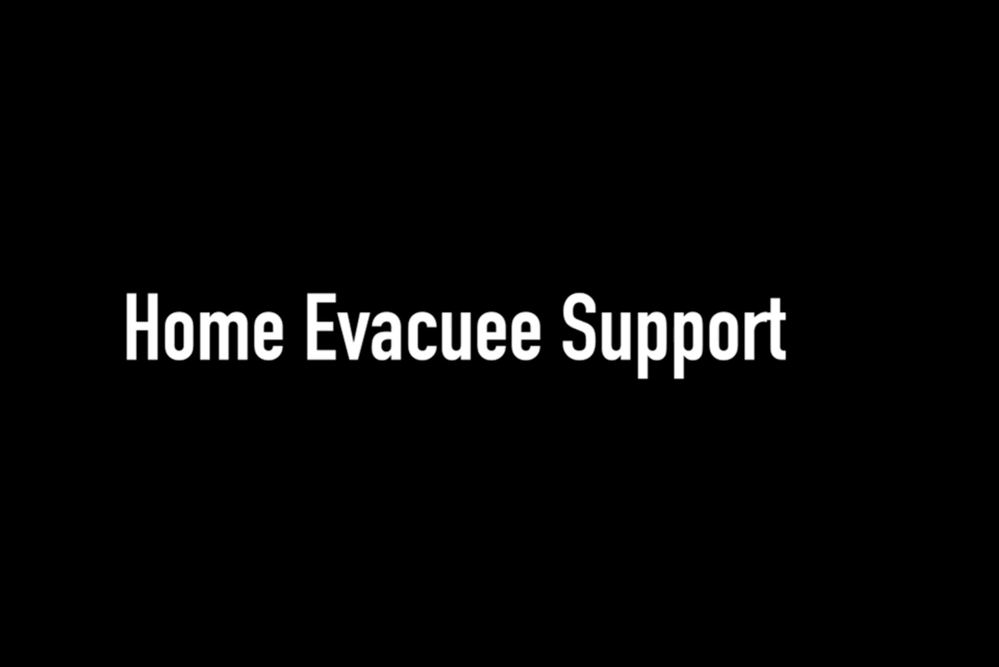
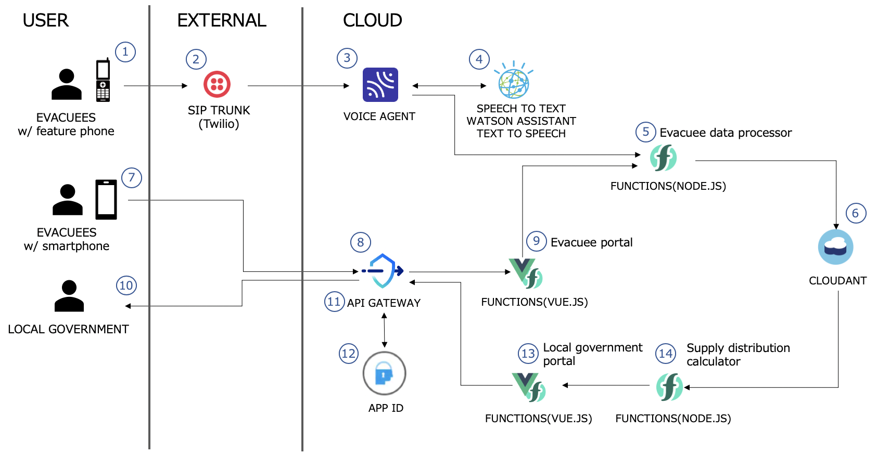
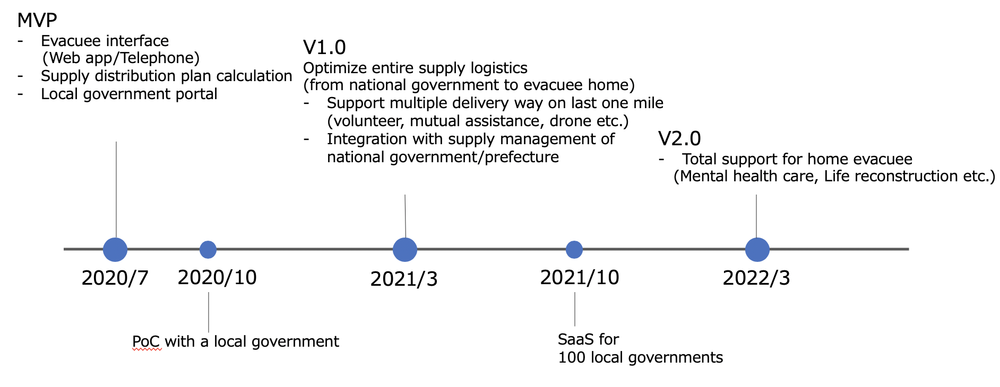

# Home Evacuee Support

A GitHub repository for "Home Evacuee Support" which distributes relief supplies to every evacuee at home quickly.

## Short description

### What's the problem?

Severe natural disasters, like heavy rain and typhoons, frequently occur because of climate change. Recently shortage of evacuation center's capacity is a big problem due to COVID-19 pandemic. Therefore, more evacuees need to stay at home. 

It is a big challenge for the local government to establish a way to support home evacuees considering the shortage of workforce in case of a disaster.
The first challenge is to know an evacuee's status, location, and demands quickly.
The second challenge is the evacuation center operation, including support for home evacuees. Specifically, assignment of supplies to evacuees. 

### How can technology help?

Our solution provides AI-powered evacuee's information collection. We can use a simple feature phone and voice agent, which helps older people to connect to local government.
We also provides the data-centric evacuee support operation. Our solution supports decision making for the operation based on data collected from evacuees. 

## Demo video

## The architecture

1. [In case of telephone interface] Evacuees with a feature phone call to our service to share their status and request for supplies.
2. The SIP Trunk provider such as Twilio forwards their call to IBM cloud 
voice agent.
3. The Voice agent automates interactions with evacuees over the telephone.
4. The Watson Speech to Text, Watson assistant and Watson Text to Speech realize the interactions with evacuees. These components ask the evacuees their status and demands.
5. The Voice agent requests to store evacuee's information to Evacuee data processor running on Cloud Functions.
6. Evacuee data processor stores evacuee's information on the Cloudant.
7. [In case of web app interface] Evacuees with a smartphone accesses to the evacuee portal.
8. The API gateway passes through their requests to the evacuation portal.
9. The vue.js app, running on Cloud Functions, returns components of the evacuee portal, like html, css and javascript files. The evacuee portal requests to store evacuee's information to the Evacuee data processor like Step.5.
10. Local government staff sends request to generate supply distribution plan.
11. The API gateway passes through their requests if the requests passes the client id authentication.
12. The App ID verifies the user token.
13. The vue.js app for the local government portal requests to calculate supply distribution plan. It returns the components for the portal including the supply distribution plan after it is created.
14. The supply distribution calculator gets data of evacuee and supply from the Cloudant and calculates a supply distribution plan.

Local government staff can use the supply distribution plan and distribute supplies to evacuees.

## Components

### Frontend/EvacueePortal

This is a web app for evacuees.

### Frontend/LocalGovernmentPortal

This is a web portal for local government. 

### CloudFunctions/ApiServices

This is a function to provide APIs. The APIs includes "Evacuee data processor" and "Supply distribution calculator".

### CloudFunctions/WatsonWebhook

This is a function to provide API which connect to voice agent and backend.

#### EvacueeInfoCollectorWithVoice

The voice agent and Watson Speech to Text, Assistant, and Text to Speech realize automation of interaction with evacuees over a telephone.

## Long description

Severe natural disasters, like heavy rain and typhoons, frequently occur because of climate change. Recently shortage of evacuation center's capacity is a big problem due to COVID-19 pandemic. Therefore, more evacuees need to stay at home. Moreover, the population of older people who are not good at using smartphones or web app is growing in Japan. Especially in a disaster, they have no space to learn new tools, even for younger people.

It is a big challenge for the local government to establish a way to support home evacuees considering the shortage of workforce in case of a disaster.
The first challenge is to know an evacuee's status, location, and demands quickly. Specifically, how many evacuees stay at home and what kind of support they need.
The second challenge is the evacuation center operation, including support for home evacuees. Specifically, assignment of supplies to evacuees. Currently, each evacuation center staff conduct such a service without any assistance. There's a lot of pressure on local government staff to consider evacuees' needs.

Our solution has two approaches. The first is AI-powered evacuee's information collection. We can use a simple feature phone and voice agent, which helps older people to connect to local government.
The second approach is the data-centric evacuee support operation. Our solution supports decision making for the operation based on data collected from evacuees. The priority is to save lives. Our solution calculates the assignment of supplies to evacuees considering their status like health, age, etc. It reduces local government workload and dissatisfaction of evacuees at the same time.

Four main features of our solution are-
1. Initial notification. The notification includes our service URL and phone number. We will notify our service using various channels like "Area Mail," an emergency alert delivered forcibly by the government to everyone in a specific area.
1. Evacuee information collector. Our service has two types of collectors. The first one is a Web app. Evacuees can share their status and request supplies using a smartphone. This app can identify the exact evacuee location with location service. The second one is a voice agent over the telephone. Evacuees share their information through natural conversation.
1. Supplies distribution plan calculator. This feature assigns supplies to each evacuee based on evacuee's status, demands, and supplies stock. Moreover, it takes care of the delivery of supplies. Our solution currently asks evacuees to pick supplies in the nearest evacuation center within specific timeslot, reducing COVID-19 infection risk. In the future, our service will share the calculated supplies delivery list with volunteers or logistics companies to deliver supplies to each evacuee's home.
1. Local government portal. The portal has a dashboard showing the evacuees' location and evacuation centers and supplies delivery list created by the supply distribution plan calculator. The upcoming dashboard will show damage to the road and others, supporting local government staff to decide their actions.

Through these features, a local government can deliver supplies to home evacuees quickly.

## Project roadmap

## Getting started

You can find setup instruction for each components.

* [EvacueePortal](Frontend/EvacueePortal/README.md)
* [LocalGovernmentPortal](Frontend/LocalGovernmentPortal/README.md)

* [API services](CloudFunctions/ApiServices/README.md)
* [Watson web hook](CloudFunctions/WatsonWebhook/README.md)

* [Evacuee Info Collector With Voice](EvacueeInfoCollectorWithVoice/README.md)

## Built with

* Cloud Functions
* API gateway
* App ID
* Cloudant
* Watson voice agent
* Watson speech to text
* Watson assistant
* Watson text to speech
* Node-RED App

## License

This project is licensed under the Apache 2 License - see the [LICENSE](LICENSE) file for details

